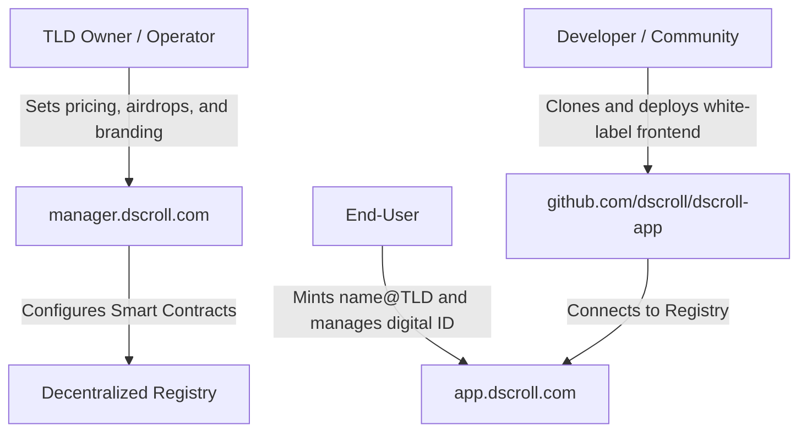

# DScroll: Democratizing Web3 Domain Issuance & Custom Brand Identity Engines

In the rapidly evolving landscape of decentralized technology, digital identity stands as the cornerstone of user ownership, trust, and connection. Traditional Web2 domains and early Web3 naming solutions have laid the foundation, but they often present high barriers to entry, continuous recurring costs, and complex technical requirements. 

**DScroll** is a revolutionary decentralized white-label ecosystem that completely democratizes the creation, management, and deployment of Top-Level Domains (TLDs) and sub-name services. By eliminating the need for custom smart contracts and complex blockchain programming, DScroll enables any brand, creator, community, or individual operator to launch a fully customized Web3 identity ecosystem in minutes.

---

## The Paradigm Shift: Why DScroll Exists

### 1. The Friction of Traditional Web3 Domain Services
Creating a custom Web3 name service (like `.eth` or `.sol`) has historically required writing custom smart contracts, managing complex blockchain architectures, and securing auditing services. DScroll eliminates these barriers entirely, allowing anybody to act as a TLD registrar with **zero coding requirements**.

### 2. Turning Domains into Brand Assets
In the Web2 world, if a corporation owns `brand.com`, only their internal IT department can use or assign subdomains (like `marketing.brand.com` or `john.brand.com`). In the Web3 paradigm powered by DScroll, the owner of a Top-Level Domain (e.g., `@brand`) can open their namespace to the public, allowing users to mint unique, self-custodial identities like `john@brand` as standard digital assets (NFTs). This transforms domains from static web links into interactive, highly collaborative brand engines.

### 3. The Death of Renewal Fees
Most traditional registries rely on an annual subscription model, charging users recurring fees to maintain ownership of their digital handle. DScroll supports **one-time pricing structures with zero renewal fees**. Once a user mints a sub-name, it is theirs forever, recorded permanently on the blockchain.

---

## How DScroll Works: The Three-Player Ecosystem

The DScroll ecosystem is structured to serve three distinct groups: TLD owners, community operators, and end-users.

### 1. The TLD Owner (The Registrar)
TLD owners possess the master Top-Level Domain on-chain. Through DScroll, they have absolute authority over their namespace:
*   **Dynamic Pricing**: They can configure how much it costs to mint a sub-name.
*   **Metadata Ownership**: They define the custom artwork, attributes, and descriptions that appear when a sub-name is minted (e.g., the visual identity of the NFT).
*   **Community Incentives**: They can fund and launch built-in sub-name airdrop campaigns to supercharge adoption.

### 2. The White-Label Operator (The Portal Builder)
Communities, organizations, and decentralized projects often want a branded, custom-designed gateway where their members can obtain official handles. DScroll provides a **production-ready, white-label open-source repository**. 
By changing a single, self-explanatory configuration file, anyone can host a custom-branded minting website under their own domain, tailored specifically to their community's look and feel, without writing any blockchain integration code from scratch.

### 3. The End-User (The Digital Citizen)
For end-users, DScroll provides an intuitive, web-friendly hub to claim, search for, and customize their Web3 names.
*   **Seamless Minting**: A clean interface allows users to check the availability of names and instantly mint them in seconds.
*   **Self-Custodial Control**: Minted subnames are owned entirely by the user's cryptographic wallet.
*   **Interactive Whois**: Anyone can search for registered handles to verify ownership, access public digital profiles, and review registration timelines.

---

## Core Value Propositions

### 🌟 Zero-Renewal Lifetime Identity
Unlike typical domain systems that charge ongoing monthly or annual fees, names minted via DScroll are a one-time purchase. Once minted, the owner maintains permanent custody unless they choose to transfer it.

### 🌟 Complete Custom Branding
The open-source core allows operators to customize logos, colors, terminology, pricing parameters, and even supported blockchains. This turns a complex Web3 protocol into a cohesive brand experience.

### 🌟 Secure Off-Chain Profiles
To prevent users from having to pay expensive transaction fees every time they want to update their contact info or profile description, the platform supports a hybrid cryptographic validation mechanism. Users can safely sign verification messages with their wallets to store off-chain data (like custom profile descriptions and email links), completely gas-free.

### 🌟 Native Community Airdrops
DScroll comes out of the box with an advanced airdrop framework. Brands can deposit rewards, allocate eligible recipients, and monitor claims, while users can claim their tokens and domain credentials in a unified, trusted interface.

---

## The Three Pillars of the DScroll Ecosystem

DScroll organizes its functionality across three primary platforms:

### 1. The Consumer Hub: [app.dscroll.com](https://app.dscroll.com)
The official, public-facing marketplace and user dashboard. This is where end-users go to search for domains, check availability, buy their favorite `username@TLD` handles, and access their personal asset dashboards. It functions as the search engine and registrar portal for the DScroll network.

### 2. The Command Center: [manager.dscroll.com](https://manager.dscroll.com)
The centralized administrative interface for domain creators and TLD owners. Here, operators can manage their custom spaces, set base prices, deploy community incentive programs, monitor transaction volumes, and customize metadata variables. It serves as the developer dashboard and governance interface.

### 3. The Open-Source Foundation: [dscroll-app on GitHub](https://github.com/dscroll/dscroll-app)
The underlying technology engine. This fully open-source, premium next-generation framework allows developers and creators to host their own white-label versions of the DScroll portal. Anyone can copy this code, drop in their custom configurations, and spin up an independent domain minting site instantly under their own URL.

---

## Conclusion

DScroll redefines the relationship between creators, communities, and digital identity. By shifting from standard web addresses to dynamic, white-label, lifetime digital assets, DScroll provides a bridge for any entity to establish its own ecosystem. Whether you are a corporate brand wanting to issue authenticated email handles to your staff, a community leader looking to reward supporters, or an end-user seeking a permanent Web3 home, DScroll provides the zero-code engine to make it happen.
